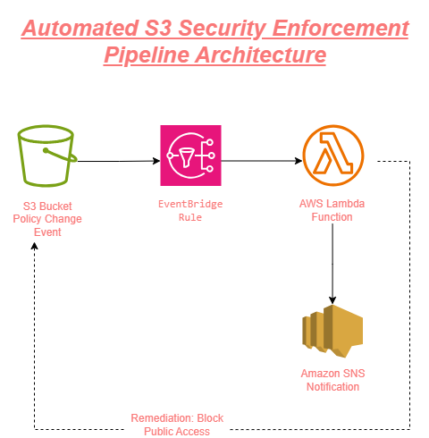
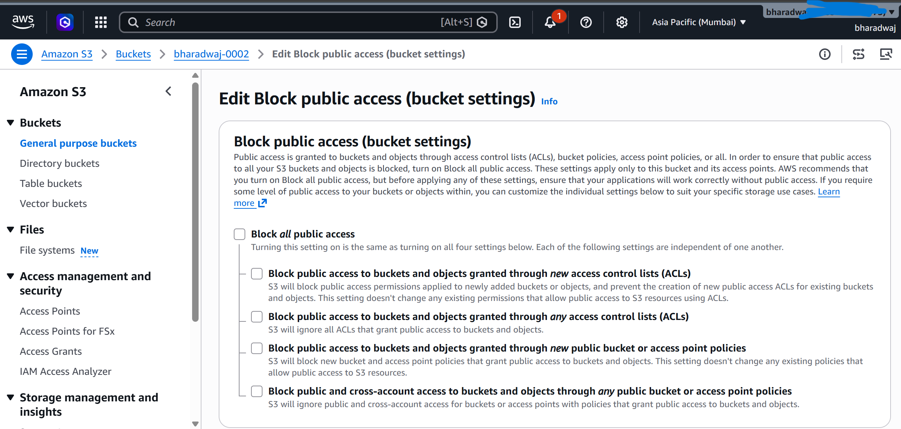
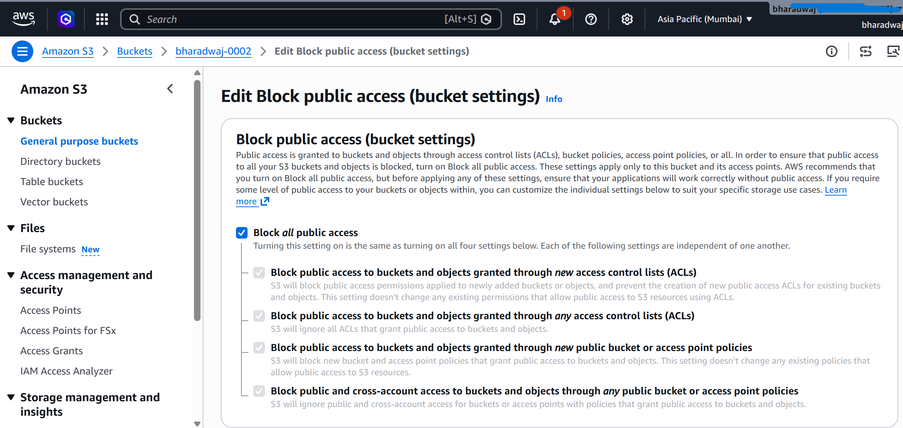
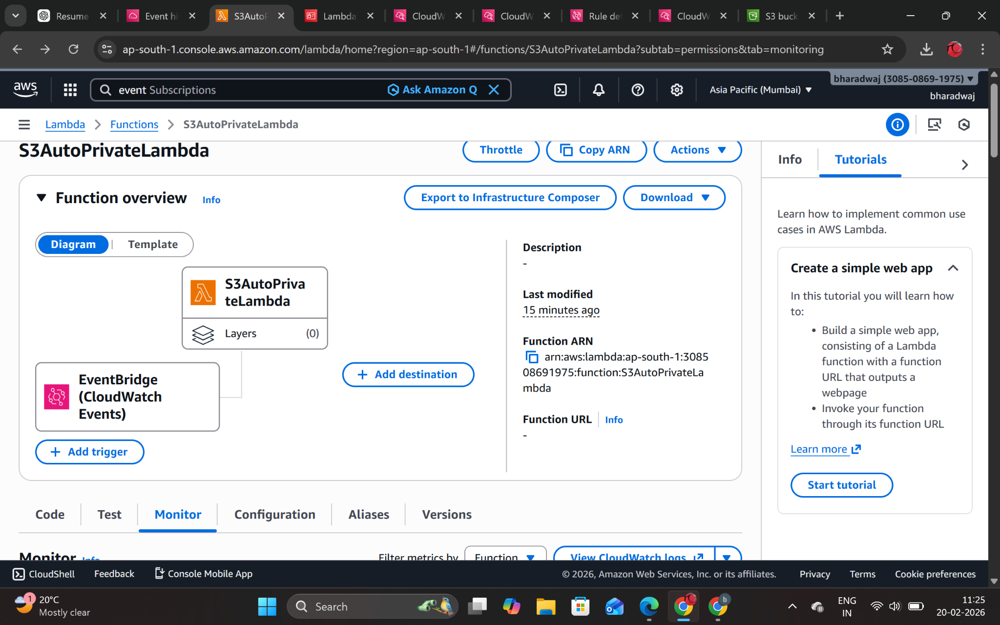
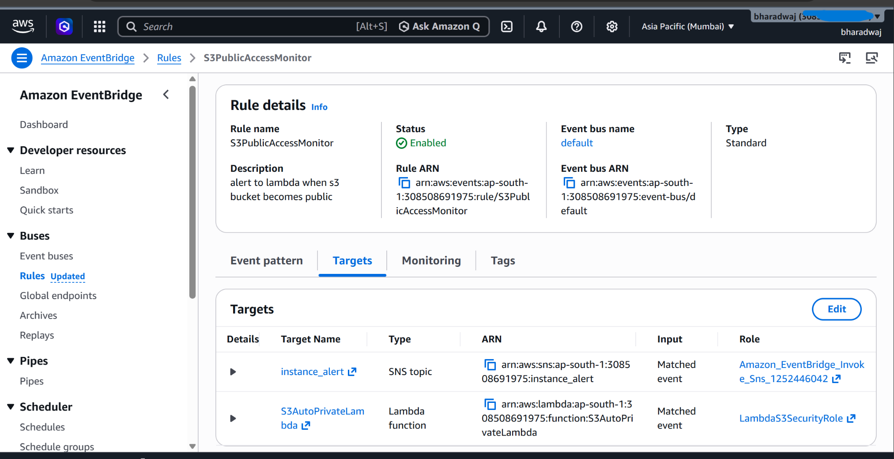
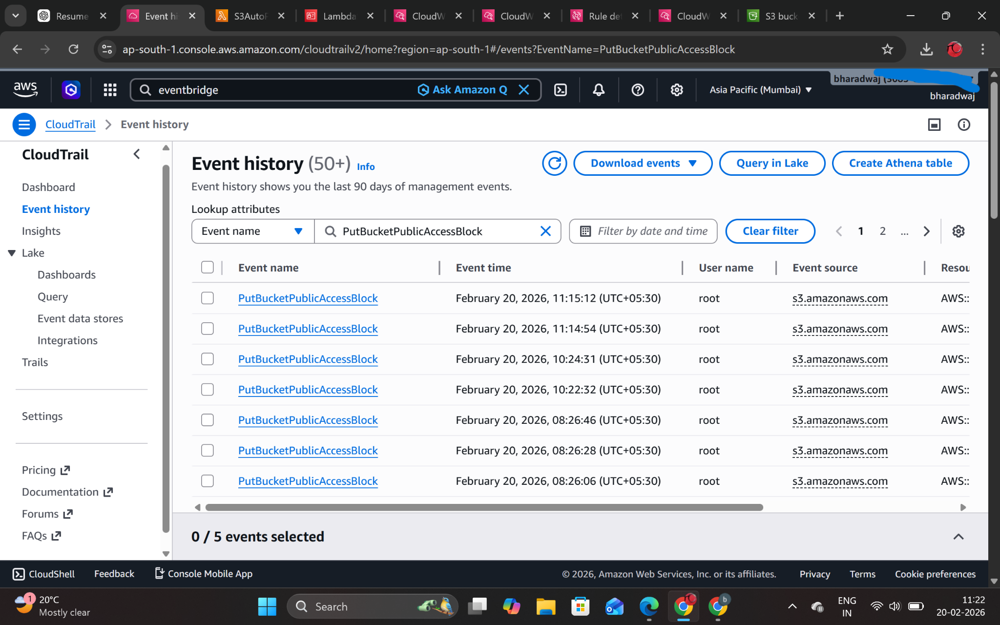
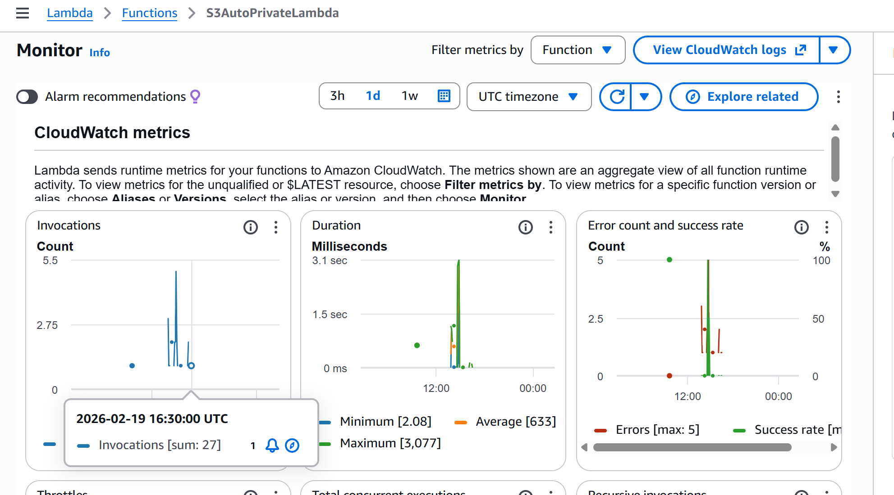

# 🔐 Automated S3 Security Enforcement Pipeline (AWS)

## 📌 Overview
This project implements an automated security pipeline to detect and remediate publicly accessible Amazon S3 buckets in real-time using AWS services.

It follows an event-driven architecture to ensure continuous monitoring and automatic enforcement of security best practices.

---

## ⚙️ Technologies Used
- AWS S3
- AWS Lambda
- Amazon EventBridge
- Amazon SNS
- IAM

---

## 🚀 Features
- Detects publicly accessible S3 buckets automatically
- Triggers AWS Lambda for remediation
- Converts public buckets into private
- Sends alerts using SNS notifications
- Enforces AWS security best practices

---

## 🏗️ Architecture

---

## 🔄 Workflow
1. S3 bucket policy or ACL is modified
2. EventBridge captures the event
3. Lambda function is triggered
4. Lambda applies public access block settings
5. SNS sends alert notification

---

## 📸 Screenshots

### S3 Bucket Before Remediation

### S3 Bucket After Remediation

### Lambda Function Monitoring

### EventBridge Rule Configuration

### CloudTrail Event Detection

### CloudWatch Metrics

---

##  Project Structure

---

##  Author
Bharadwaj Yerraguntla